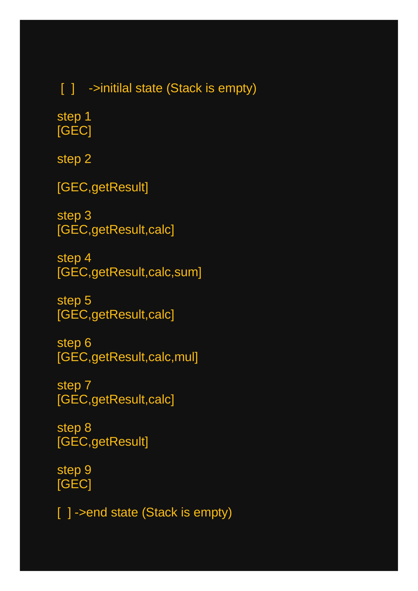
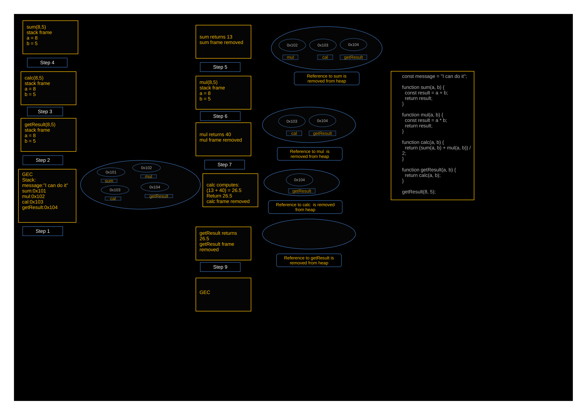

📌 Overview

Day 08 marks the beginning of Module 02, where I move beyond basic JavaScript and start understanding how JavaScript works internally.

In this project, I explored:

    🌍 Global Execution Context (GEC)
    ⚙️ Function Execution Context (FEC)
    🧠 Creation Phase (CP) & Execution Phase (EP)
    📚 Call Stack (LIFO)
    📦 Heap Memory

This is a core foundation topic that helps in understanding advanced concepts like closures, async JS, and debugging.

🧾 The Code

const message = "I can do it";

function sum(a, b) {
  const result = a + b;
  return result;
}

function mul(a, b) {
  const result = a * b;
  return result;
}

function calc(a, b) {
  return (sum(a, b) + mul(a, b)) / 2;
}

function getResult(a, b) {
  return calc(a, b);
}

getResult(8, 5);

Diagrams.

For GEC,FEC.jpg:

For Stack_diagram-1.jpg:

For Stack_Heap_flow.png:

